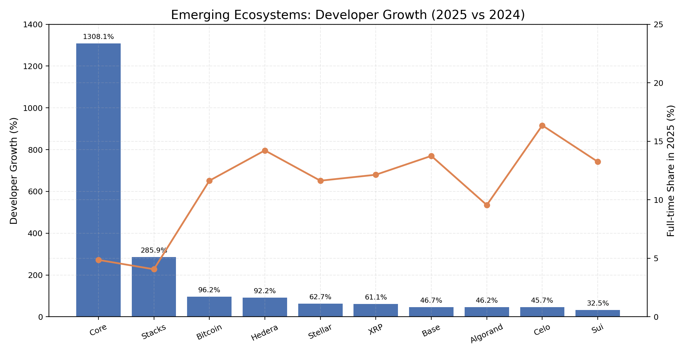
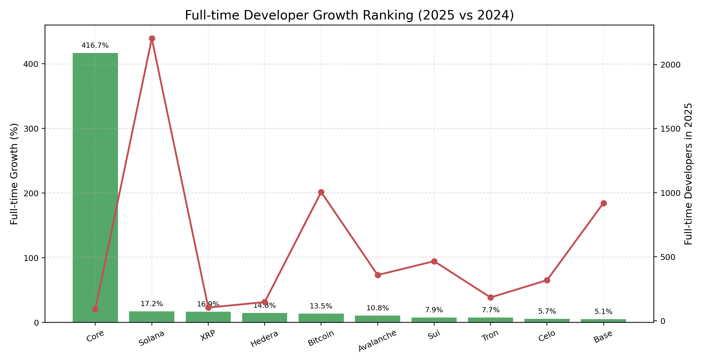
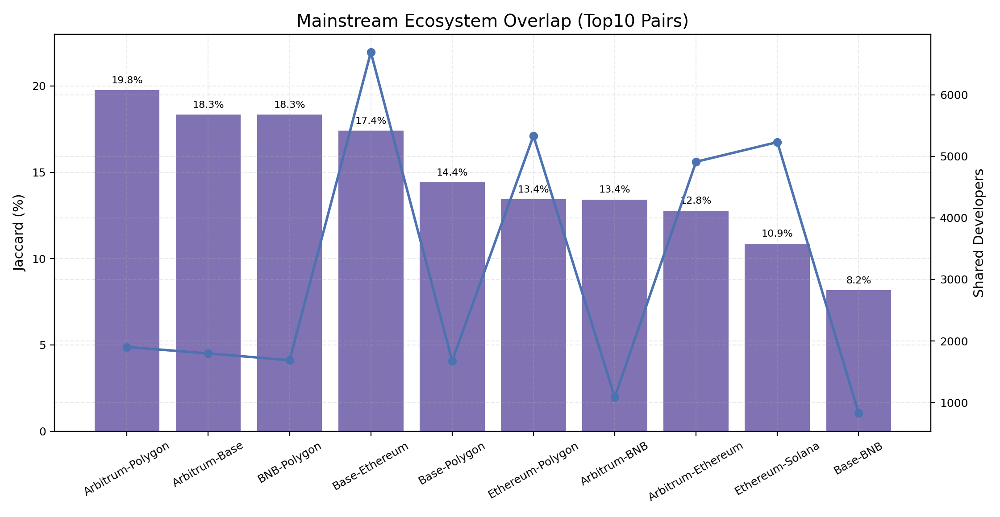
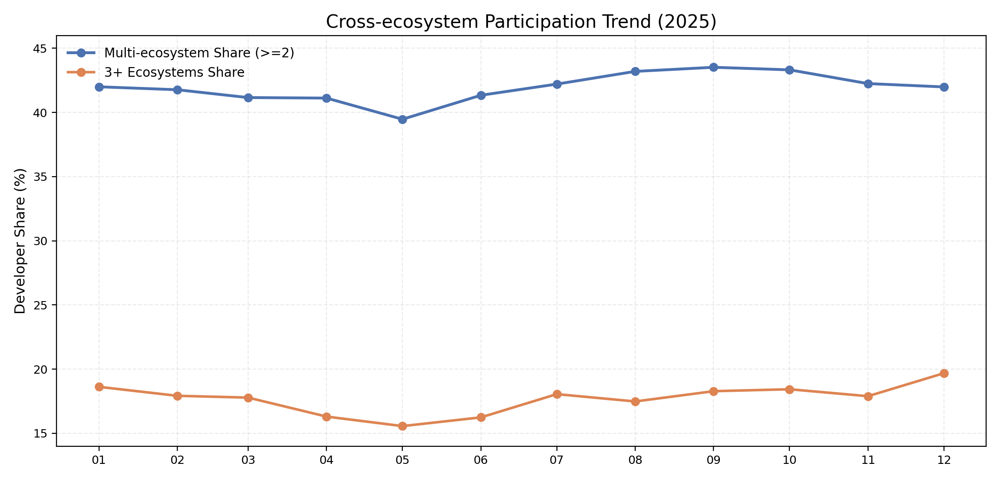
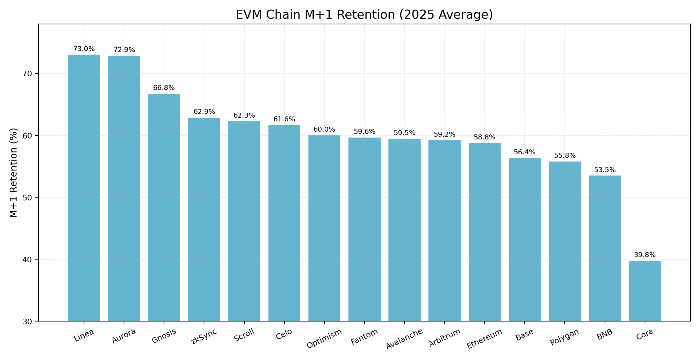
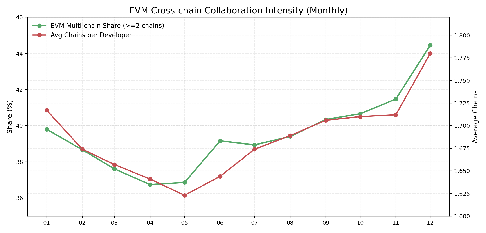

# 生态系统
## 一、跨链与技术栈维度
### 关键结论
2025 年，多链开发已成为常态。按代码提交统计，开发者多链占比从 2015 年 1 月的 9.8% 提升到 2025 年 12 月的 42.4%；开发活动统计同期从 8.6% 提升到 43.1%。
- 多链深度继续提升。2025 年人均参与链数从 1.77 升至 1.93；3 条及以上链占比从 15.5% 升至 19.7%；4 条及以上链占比从 8.4% 升至 11.1%。
- EVM 仍是跨链协作中心。多链开发者中，触达 EVM 生态的占比在 74.8% 至 84.5% 区间；同时，跨 EVM 与非 EVM 的混合开发已成为主流形态之一。
- 链间共享开发者明显向以太坊汇聚。Top10 生态中，多条链与以太坊重叠比例为本链最高。
- 跨链组合呈现“头部双链稳定、三链更分散”的结构特征。

### 1. 多链参与趋势
长期趋势显示，多链占比在 2021 年后加速提升，并在 2024—2025 年稳定在 40% 以上。 
2025 年按月观察，多链占比维持在 39.4%—43.4% 区间。

### 2. 多链深度与链数分布
2025 年开发者仍以单链为主，但多链已接近半数。按全年去重统计： 
- 2 条链：代码提交统计为 24.2%，开发活动统计为 22.8% 
- 3 条链：8.5% / 8.7% 
- 4 条及以上：11.2% / 13.4% 

这表明跨链行为已从“尝试参与”走向“并行协作”。

### 3. 生态渗透与链间共享
从生态渗透率看，不同链在跨链网络中的角色已经分化：部分生态具备明显的跨链辐射能力，部分生态仍以单链开发为主。 
从链间共享矩阵看，开发者流动在头部生态之间高度集中，且普遍向以太坊汇聚。例如 Solana→Ethereum 为 35.0%，Cosmos→Ethereum 为 41.6%；Base 与 Arbitrum 与 Ethereum 的重叠接近 100%。

### 4. 跨链组合结构
双链组合集中度高，三链组合更分散： 
- 双链 Top10 组合占比：代码提交统计为 67.7%，开发活动统计为 60.4%，HHI 为 0.0647 / 0.0507 
- 三链 Top10 组合占比：30.8% / 28.5%，HHI 为 0.0135 / 0.0125 

这意味着双链协作路径更稳定，三链及以上更多体现探索性扩展。

#### 5. 技术栈偏好与融合
从多链开发者内部结构看： 
- 混合栈开发者占比 47.8% 
- EVM 单栈占比 33.3% 
- 非 EVM 单栈占比 18.9% 

说明跨技术栈协作已是主流工作方式，而非边缘行为。 
单栈开发者中，EVM 仍居首，但 SVM、Move 等非 EVM 栈已形成稳定体量。2025 年 12 月：EVM 5,834，SVM 1,548，Move 442，Polkadot 293，Cosmos 250，Other 2,665。

#### 6. 2025 年关键指标汇总
| 统计方式 | 2025 去重开发者数 | 2025 多链占比（全年） | 2025-12 多链占比 |
|---|---:|---:|---:|
| 代码提交统计 | 71,023 | 43.9% | 42.4% |
| 开发活动统计 | 121,531 | 45.0% | 43.1% |

#### 7. 结论意义
- 对生态方：跨链能力已成为开发者吸引与留存的核心变量，单链叙事对增量开发者的解释力在下降。 
- 对基础设施与工具链：支持多链协作、多栈开发、跨链调试的工具将持续受益。 
- 对行业判断：2025 年的开发者行为更接近“跨生态协同网络”，而非“彼此孤立的链内社区”。

## 二、新兴生态维度

### 2.1 增长潜力：新崛起生态（开发者 >= 500）

按 2025 年开发者规模门槛（>=500）筛选后，开发者增长排名前列生态如下（2025 相比 2024）：

| 排名 | 生态 | 2024开发者 | 2025开发者 | 开发者增长率 | 2025全职占比 |
|---|---|---:|---:|---:|---:|
| 1 | Core | 136 | 1,915 | 1308.09% | 4.86% |
| 2 | Stacks | 779 | 3,006 | 285.88% | 4.06% |
| 3 | Bitcoin | 4,409 | 8,651 | 96.21% | 11.63% |
| 4 | Hedera | 538 | 1,034 | 92.19% | 14.22% |
| 5 | Stellar | 1,369 | 2,227 | 62.67% | 11.63% |
| 6 | XRP | 532 | 857 | 61.09% | 12.14% |
| 7 | Base | 4,561 | 6,692 | 46.72% | 13.75% |
| 8 | Algorand | 716 | 1,047 | 46.23% | 9.55% |
| 9 | Celo | 1,334 | 1,944 | 45.73% | 16.36% |
| 10 | Sui | 2,655 | 3,518 | 32.50% | 13.25% |

这组结果说明，开发者增速与投入深度并不总是同步。`Core`、`Stacks` 增长最快，但 2025 全职占比仍在 5% 左右；`Celo`、`Hedera` 的增速虽然低于头部，但全职占比更高，增长稳定性更好。`Base` 代表了另一类路径：在较大基数上继续扩张，增速不极端但贡献体量大。

### 2.2 分类排名

按“总体开发者增长”排名（Top 10）：
- `Core`、`Stacks`、`Bitcoin`、`Hedera`、`Stellar`、`XRP`、`Base`、`Algorand`、`Celo`、`Sui`

按“全职开发者增长”排名（Top 10，2025 对比 2024）：

| 排名 | 生态 | 2024全职 | 2025全职 | 全职增长率 |
|---|---|---:|---:|---:|
| 1 | Core | 18 | 93 | 416.67% |
| 2 | Solana | 1,881 | 2,204 | 17.17% |
| 3 | XRP | 89 | 104 | 16.85% |
| 4 | Hedera | 128 | 147 | 14.84% |
| 5 | Bitcoin | 886 | 1,006 | 13.54% |
| 6 | Avalanche | 323 | 358 | 10.84% |
| 7 | Sui | 432 | 466 | 7.87% |
| 8 | Tron | 170 | 183 | 7.65% |
| 9 | Celo | 301 | 318 | 5.65% |
| 10 | Base | 875 | 920 | 5.14% |

这里的排名说明“总量增长”和“全职增长”已经分叉。`Solana` 在规模扩大的同时全职人数继续上升，属于少数两端都改善的生态；`Core` 的同比非常亮眼，但当前仍是“高增速、低全职占比”结构，后续应继续跟踪其留存与持续贡献。

补充指标（样本整体）：
- 样本生态数：`36`；其中同比增长生态：`24`（`66.67%`）。
- 样本中位开发者增速：`17.65%`。
- 增长组平均全职占比：`15.11%`；非增长组：`19.84%`。

## 三、生态间关联维度

### 3.1 开发者共享：主流生态重合度与流动趋势

2025 年主流生态（Top10）共享关系中，Jaccard 重合度 Top5：

| 排名 | 生态对 | 交集开发者 | Jaccard |
|---|---|---:|---:|
| 1 | Arbitrum ↔ Polygon | 1,902 | 19.76% |
| 2 | Arbitrum ↔ Base | 1,798 | 18.34% |
| 3 | BNB Chain ↔ Polygon | 1,687 | 18.34% |
| 4 | Base ↔ Ethereum | 6,692 | 17.41% |
| 5 | Base ↔ Polygon | 1,676 | 14.41% |

重合矩阵显示，开发者共享主要集中在 EVM 主链与 L2 之间。`Base -> Ethereum`、`Arbitrum -> Ethereum` 的单向重合率都为 100%，说明 L2 开发者普遍同时覆盖 Ethereum。Top10 两两组合共 `45` 对，整体平均 Jaccard 为 `6.28%`，但前 5 对平均达到 `17.65%`，并贡献了总交集开发者的 `25.00%`，头部集中明显。

跨生态开发者频率（2025 月度）：

- 多生态开发者占比（>=2 生态）全年在 `39.47% - 43.52%` 间波动，没有出现趋势性下滑。
- 9-11 月维持在年内高位（`43.52% / 43.32% / 42.25%`），未出现明显回落。
- 月均多生态占比 `41.94%`，接近“每 5 个开发者中约 2 个跨生态协作”。

### 3.2 技术协同：EVM 生态内留存与跨链协作

EVM 链集合（月留存口径）采用：
`Ethereum, Base, Arbitrum, Polygon, Optimism, BNB Chain, Avalanche, Linea, zkSync, Celo, Gnosis Chain, Scroll, Fantom, Aurora, Core`

EVM 链 `M+1` 开发者留存率（2025-01 至 2025-11 均值）Top5：

| 排名 | 链 | 平均次月留存率 | 平均月活开发者 |
|---|---|---:|---:|
| 1 | Linea | 73.00% | 331.8 |
| 2 | Aurora | 72.86% | 233.7 |
| 3 | Gnosis Chain | 66.75% | 174.4 |
| 4 | zkSync | 62.87% | 325.7 |
| 5 | Scroll | 62.28% | 202.0 |

EVM 跨链协作强度（按月，开发者在 EVM 中参与 >=2 链）：

- 2025-01：`39.80%`
- 2025-06：`39.16%`
- 2025-09：`40.34%`
- 2025-12：`44.45%`（年内高位）

EVM 内协作强度在年内抬升：多链参与占比从 `39.80%` 提高到 `44.45%`，人均触达链数从 `1.717` 到 `1.780`。留存方面，`Linea`、`Aurora` 处于高位，`Core` 波动更大，仍在扩张期。

补充指标（EVM 集合整体）：
- 链级平均 `M+1` 留存：`60.13%`（最低 `39.76%`，最高 `73.00%`）。
- 月均 EVM 多链开发者占比：`39.51%`；月均人均触达链数：`1.686`。

